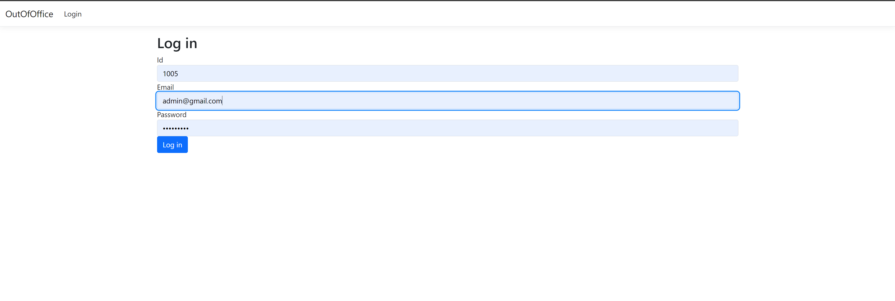
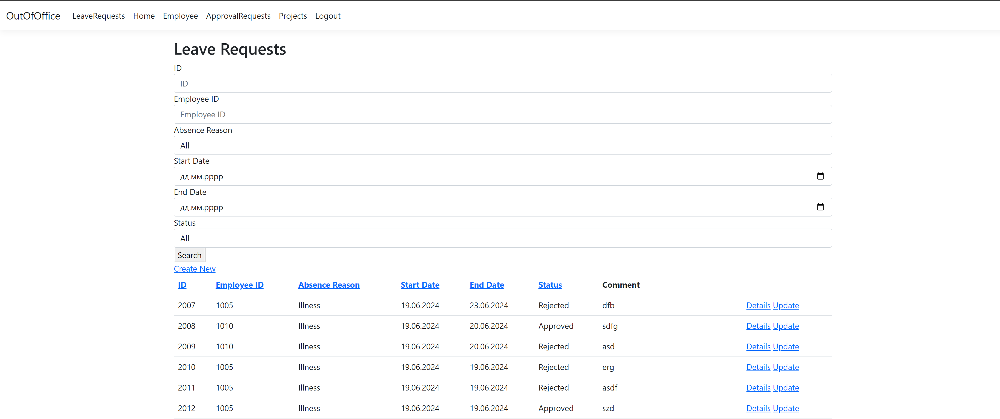
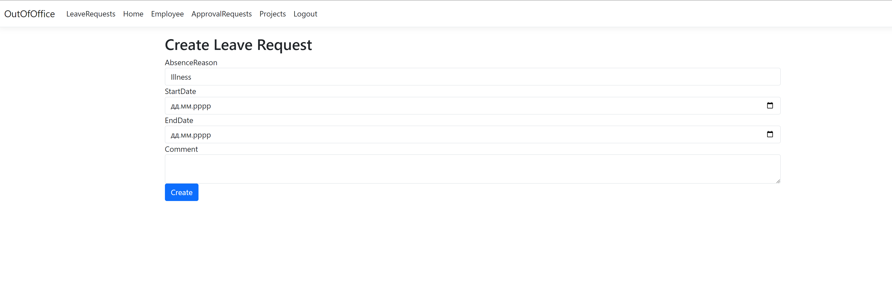
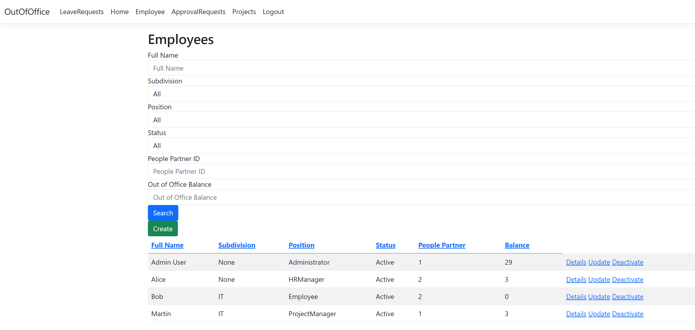
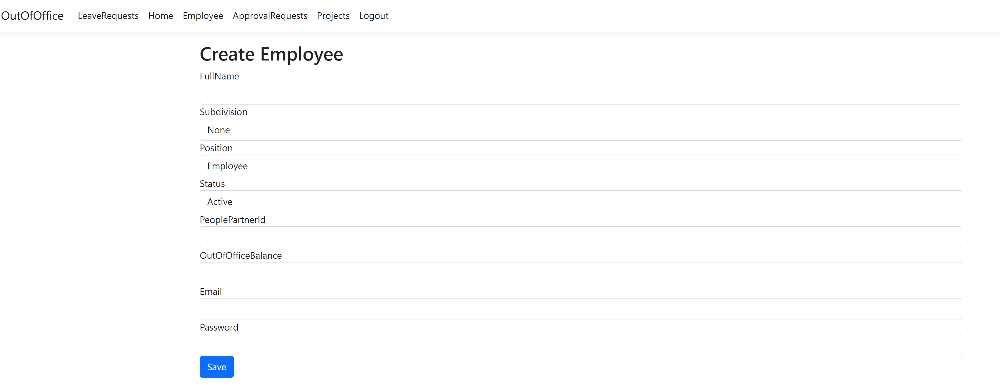
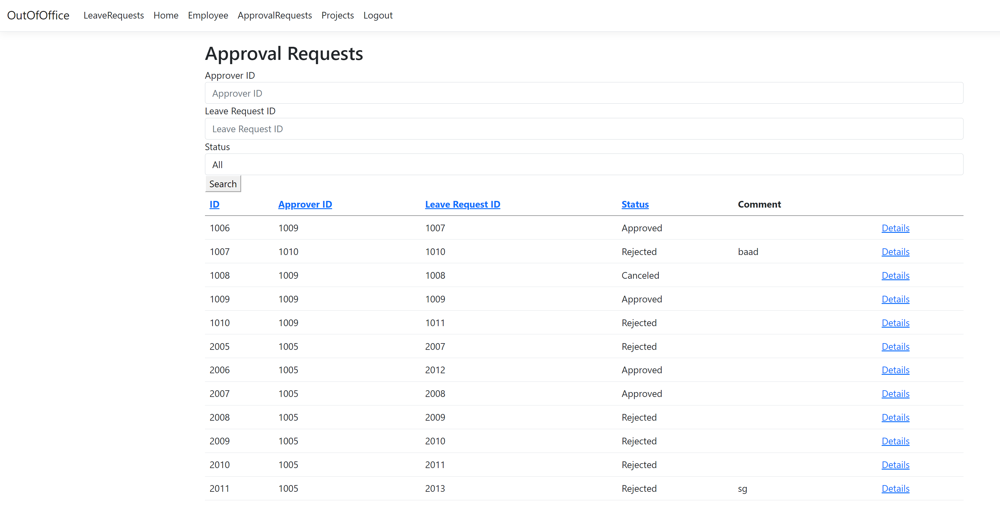
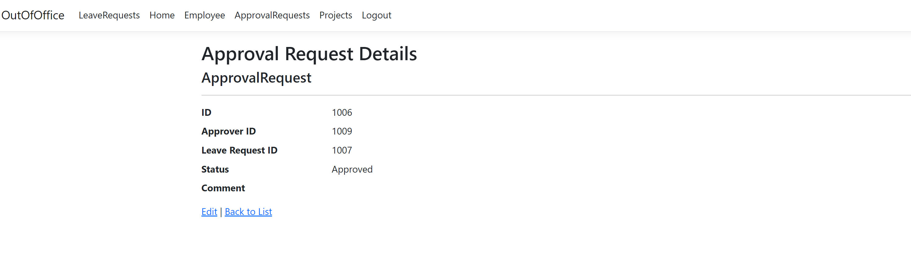
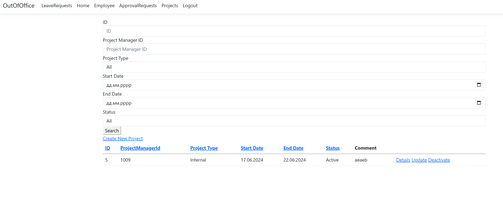
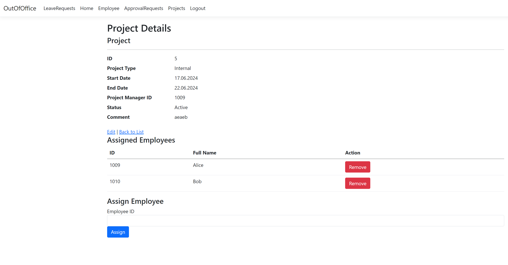

You have admin account where you can create other employees and work with them:

email = admin@gmail.com
password = Test1234!

Creation if database

Pages:

Login:

Leave Requests:

Employees:

Approval Requests:

Projects:

